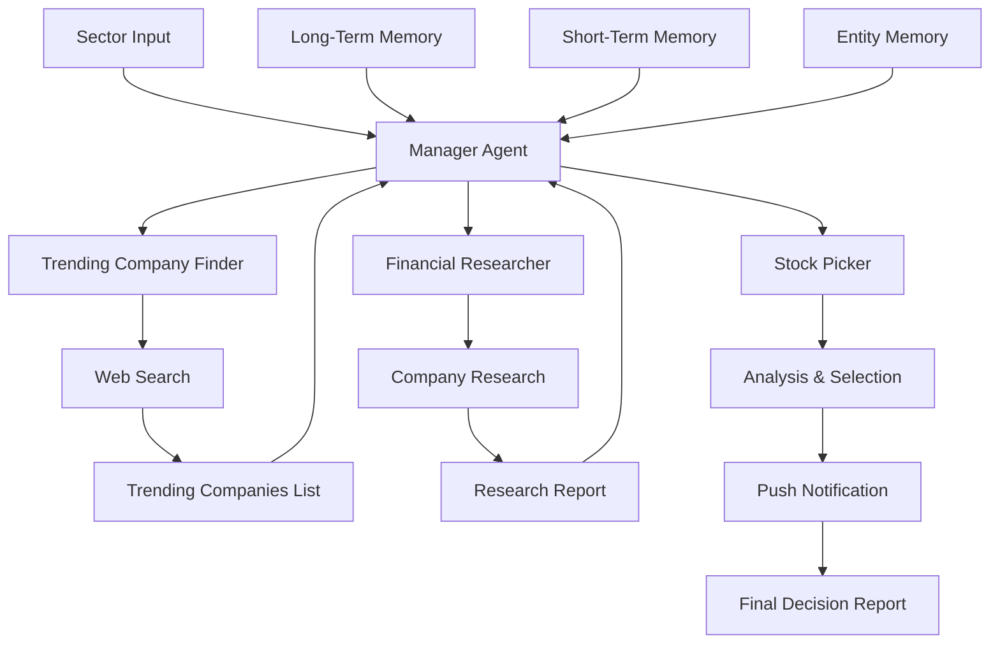

# AI Stock Selection Platform - Intelligent Investment Analysis

An advanced multi-agent AI system powered by [crewAI](https://crewai.com) that autonomously identifies trending companies, conducts comprehensive financial research, and selects the best investment opportunities. The platform uses hierarchical agent orchestration with advanced memory capabilities to make informed stock selection decisions.

## 🎯 Overview

AI Stock Selection Platform is an intelligent investment analysis system that automates the process of stock selection. It uses multiple specialized AI agents working under a manager to find trending companies, research them thoroughly, and select the best investment opportunity based on comprehensive analysis.

## ✨ Features

- **Trending Company Discovery**: Automatically identifies 2-3 trending companies in any sector from latest news
- **Comprehensive Research**: Deep financial analysis of each trending company
- **Intelligent Selection**: AI-powered selection of the best investment opportunity
- **Hierarchical Architecture**: Manager agent delegates tasks to specialized agents
- **Advanced Memory System**: 
  - Long-term memory for persistent storage across sessions
  - Short-term memory using RAG for current context
  - Entity memory for tracking key information
- **Push Notifications**: Real-time notifications when investment decisions are made
- **Web Search Integration**: Real-time web search using SerperDevTool for up-to-date information
- **Structured Output**: JSON and Markdown reports with detailed analysis
- **Duplicate Prevention**: Ensures companies are not selected twice

## 🏗️ Architecture

The system uses a hierarchical process with a manager orchestrating specialized agents:



## 🤖 Agents

### Manager Agent
- **Role**: Project Manager orchestrating the team
- **Responsibilities**: Task delegation and coordination
- **Model**: GPT-4o
- **Capabilities**: Delegates tasks to the right agents to achieve investment goals

### Trending Company Finder
- **Role**: Financial News Analyst
- **Responsibilities**: 
  - Read latest news
  - Find 2-3 trending companies in specified sector
  - Ensure no duplicate selections
- **Tools**: SerperDevTool for web search
- **Model**: GPT-4o-mini
- **Memory**: Enabled for tracking previously found companies
- **Output**: JSON list of trending companies

### Financial Researcher
- **Role**: Senior Financial Researcher
- **Responsibilities**:
  - Comprehensive analysis of trending companies
  - Market position analysis
  - Future outlook assessment
  - Investment potential evaluation
- **Tools**: SerperDevTool for web search
- **Model**: GPT-4o-mini
- **Output**: Detailed research report in JSON format

### Stock Picker
- **Role**: Stock Selection Analyst
- **Responsibilities**:
  - Analyze research findings
  - Select best company for investment
  - Provide detailed rationale
  - Send push notification
- **Tools**: PushNotificationTool
- **Model**: GPT-4o-mini
- **Memory**: Enabled for tracking previous selections
- **Output**: Markdown report with selection and rationale

## 📋 Prerequisites

- Python >=3.10 <3.13
- [UV](https://docs.astral.sh/uv/) package manager
- OpenAI API key (for all agents)
- Serper API key (for web search)
- Pushover credentials (optional, for notifications)

## 🔧 Installation

1. **Install UV** (if not already installed)
   ```bash
   pip install uv
   ```

2. **Clone the repository**
   ```bash
   git clone https://github.com/mustafasamy28/ai-stock-selection-platform.git
   cd ai-stock-selection-platform
   ```

3. **Install dependencies**
   ```bash
   crewai install
   ```
   Or using UV directly:
   ```bash
   uv sync
   ```

4. **Set up environment variables**
   Create a `.env` file in the root directory:
   ```env
   OPENAI_API_KEY=your_openai_api_key_here
   SERPER_API_KEY=your_serper_api_key_here
   PUSHOVER_USER=your_pushover_user_key_here  # Optional
   PUSHOVER_TOKEN=your_pushover_token_here    # Optional
   ```

   Get your Serper API key at: [serper.dev](https://serper.dev)
   Get your Pushover credentials at: [pushover.net](https://pushover.net)

## 🚀 Usage

### Running Stock Selection

To start the stock selection process:

```bash
crewai run
```

Or using Python directly:

```bash
python -m stock_picker.main
```

### Customizing the Sector

Edit `src/stock_picker/main.py` to change the target sector:

```python
inputs = {
    'sector': 'Technology',  # Change to your desired sector
    "current_date": str(datetime.now())
}
```

### Example Sectors

- Technology
- Healthcare
- Finance
- Energy
- Consumer Goods
- Any market sector

## 📊 Output Files

The system generates several output files:

1. **output/trending_companies.json**: List of trending companies found
2. **output/research_report.json**: Comprehensive research on each company
3. **output/decision.md**: Final selection with detailed rationale

## 📁 Project Structure

```
.
├── src/
│   └── stock_picker/
│       ├── __init__.py
│       ├── main.py              # Entry point
│       ├── crew.py               # Crew definition with memory
│       ├── config/
│       │   ├── agents.yaml       # Agent configurations
│       │   └── tasks.yaml        # Task definitions
│       └── tools/
│           ├── __init__.py
│           └── push_tool.py     # Push notification tool
├── output/                       # Generated reports
│   ├── trending_companies.json
│   ├── research_report.json
│   └── decision.md
├── memory/                       # Memory storage
│   ├── long_term_memory_storage.db
│   └── chroma.sqlite3
├── knowledge/                    # Knowledge base
├── pyproject.toml               # Project configuration
└── README.md                    # This file
```

## 🧠 Memory System

The platform features a sophisticated three-tier memory system:

### Long-Term Memory
- **Storage**: SQLite database
- **Purpose**: Persistent storage across sessions
- **Use Case**: Remember companies analyzed in previous runs

### Short-Term Memory
- **Storage**: RAG (Retrieval-Augmented Generation) with ChromaDB
- **Purpose**: Current context and session information
- **Use Case**: Maintain context during current analysis

### Entity Memory
- **Storage**: RAG with ChromaDB
- **Purpose**: Track key information about entities (companies)
- **Use Case**: Store and recall company-specific information

## ⚙️ Configuration

### Agents Configuration

Modify `src/stock_picker/config/agents.yaml` to customize agent roles, goals, and models.

### Tasks Configuration

Modify `src/stock_picker/config/tasks.yaml` to customize research scope and selection criteria.

## 🔍 Use Cases

- **Investment Research**: Automated identification of investment opportunities
- **Market Analysis**: Stay informed about trending companies
- **Portfolio Management**: Discover new investment candidates
- **Sector Analysis**: Analyze specific market sectors
- **Educational**: Learn about stock selection and financial analysis

## 🛠️ Technology Stack

- **crewAI**: Multi-agent orchestration framework
- **OpenAI API**: GPT-4o-mini and GPT-4o for agents
- **SerperDevTool**: Web search capabilities
- **Pushover API**: Push notifications
- **ChromaDB**: Vector database for RAG memory
- **SQLite**: Long-term memory storage
- **Python**: Core programming language
- **UV**: Fast Python package manager
- **YAML**: Configuration management

## 📈 Analysis Process

1. **Discovery Phase**: Find trending companies in the specified sector
2. **Research Phase**: Conduct comprehensive financial analysis
3. **Selection Phase**: Analyze research and select best opportunity
4. **Notification Phase**: Send push notification with decision
5. **Reporting Phase**: Generate detailed markdown report

## ⚠️ Important Notes

- **Not for Trading Decisions**: This system is for research and analysis purposes only. Do not use as the sole basis for trading decisions.
- **Information Accuracy**: While the system uses reliable sources, always verify critical information
- **Memory Persistence**: Memory files are stored locally and persist across sessions
- **API Costs**: Web search and AI model usage may incur API costs
- **Duplicate Prevention**: The system tracks previously selected companies to avoid duplicates

## 🎓 Learning Resources

- [crewAI Documentation](https://docs.crewai.com)
- [crewAI GitHub Repository](https://github.com/joaomdmoura/crewai)
- [Join crewAI Discord](https://discord.com/invite/X4JWnZnxPb)
- [Serper API Documentation](https://serper.dev)
- [Pushover API Documentation](https://pushover.net/api)

## 🤝 Contributing

Contributions are welcome! Please feel free to submit a Pull Request. For major changes, please open an issue first to discuss what you would like to change.

## 📝 License

This project is open source and available under the MIT License.

## 👤 Author

**Mostafa Samy**

- LinkedIn: [mostafa-samy](https://www.linkedin.com/in/mostafa-samy-9b95711a7/)
- Portfolio: [mostafa-samy.vercel.app](https://mostafa-samy.vercel.app/)

## 🙏 Acknowledgments

- Built with [crewAI](https://crewai.com) - An amazing framework for multi-agent AI systems
- Powered by OpenAI API
- Web search powered by [Serper](https://serper.dev)
- Notifications powered by [Pushover](https://pushover.net)

## 📊 Example Output

The system generates:

- **Trending Companies**: JSON list with company names, tickers, and trending reasons
- **Research Report**: Detailed analysis including market position, future outlook, and investment potential
- **Decision Report**: Final selection with comprehensive rationale and comparison with other candidates

---

**Note**: This project demonstrates advanced investment analysis automation using hierarchical multi-agent AI systems with sophisticated memory capabilities. It showcases expertise in AI agent orchestration, financial analysis, web research, and intelligent decision-making systems.

